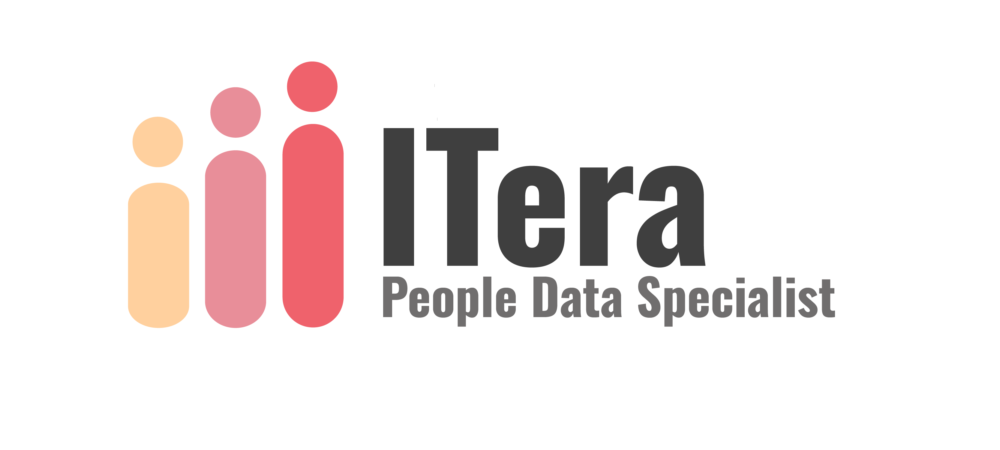

# 📊 PROYECTO

ITera > *PEOPLE DATA SPECIALIST*

## 📌 OBJETIVO

El objetivo de este proyecto para la empresa **ABC Corporation** es analizar su plantilla de empleados con el objetivo de identificar los factores clave que inciden en la **rotación del personal** y desarrollar estrategias para su reducción.

---

## 🎥 PRESENTACIÓN

🔗 https://view.genially.com/67dc6ca9dc0bca3e7f278f79/presentation-itera

---

## 📂 ESTRUCTURA DEL REPOSITORIO

* 📓 hr_project.ipynb - Jupyter Notebook del análisis de los datos
* 📄 hr_raw_data.csv - Datos proporcionados en bruto
* 📊 df_hr_final.csv - Datos procesados
* 📑 informe_retencion.pdf - Informe final
* 📜 README.md - Este fichero

---

## 🔄 FLUJO DE TRABAJO

1️⃣ Exploración de la Información Proporcionada 📊

* 🔍 Exploración de Datos
* 🧹 Limpieza de Datos: valores atípicos, corrección de tipos de datos y normalización
* 🚫 Gestión de Nulos
* 🔄 Gestión de Duplicados

2️⃣ Análisis de Datos y Obtención de *Insights* 📈

* 📊 Visualización
* 📌 Correlaciones
* 🔀 Cruces entre Variables

3️⃣ Presentación de Conclusiones 📝

* 🏢 Situación de ABC Corporation
* 🔑 Estudio de Claves de Retención
* ✅ Retención Óptima
* ⚠️ Retención a Optimizar
* 🚀 Retos y Recomendaciones
* 🔎 Conclusiones (*Key Points* de Retención)

---

## 🛠️ HERRAMIENTAS

* 🖥️ Visual Studio Code + Python 3.9+
* 📦 Librerías de Python: Pandas, NumPy, Matplotlib, Seaborn, Sklearn
* 📅 Marco de trabajo Scrum
* 🎨 Genially

---

## 👩‍💻 AUTORAS - ITera:

* 👩‍💼 Carla Vera
* 👩‍💼 Jana Raga
* 👩‍💼 Elisa García
* 👩‍💼 Cristina Fernández

**📌 Proyecto desarrollado con compromiso y empleo del análisis de datos para mejorar la retención de talento en ABC Corporation. 🚀**